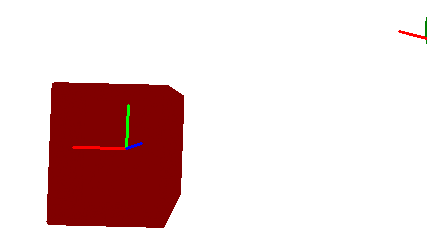
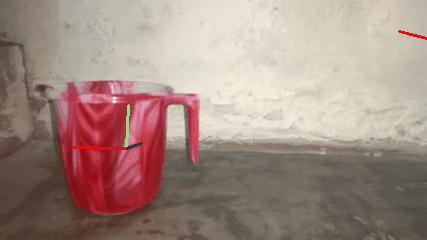
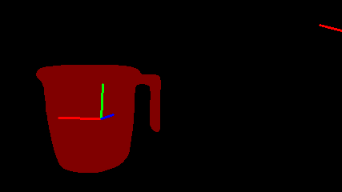
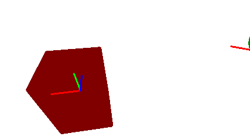
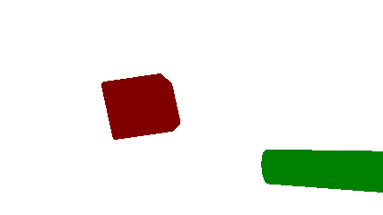
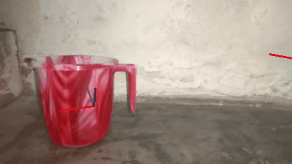
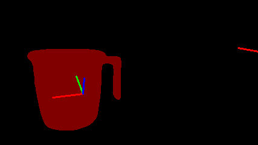
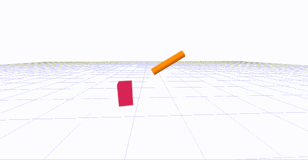

# About
This repository contains code for the IROS 2022 submission titled **Learning Object Manipulation Skills from Video via Approximate Differentiable Physics**.
In case of any question contact us at *vladimir.petrik@cvut.cz* or *makarand.tapaswi@iiit.ac.in*.

Additional data:
[Project page](https://data.ciirc.cvut.cz/public/projects/2022Real2SimPhysics/), 
[ArXiv](https://arxiv.org/abs/2208.01960), 
[YouTube video](https://youtu.be/QS6TDqr87gc).

[//]: # ([arXiv]&#40;TBD&#41;,)
[//]: # ([Paper PDF]&#40;https://drive.google.com/file/d/1DuHan9oZXznDnXiCP7J6ogWn8FMAAkIJ/view&#41;)

Citation:
```bibtex
@inproceedings{petrik2022real2simphysics,
  author = {Vladimir Petrik and Mohammad Nomaan Qureshi and Josef Sivic and Makarand Tapaswi},
  title = {{Learning Object Manipulation Skills from Video via Approximate Differentiable Physics}},
  booktitle = {IEEE/RSJ International Conference on Intelligent Robots and Systems (IROS)},
  year = {2022}
}
```


# Installation

## Mamba in miniconda
Mamba is a reimplementation of the conda package manager in C++ - faster and better in resolving dependencies.
It should work in conda too so feel free to replace `mamba` with `conda` if you do not want to install Mamba. 
```bash
mkdir -p ~/miniconda3
wget https://repo.anaconda.com/miniconda/Miniconda3-latest-Linux-x86_64.sh -O ~/miniconda3/miniconda.sh
bash ~/miniconda3/miniconda.sh -b -u -p ~/miniconda3
rm -rf ~/miniconda3/miniconda.sh
~/miniconda3/bin/conda init bash
~/miniconda3/bin/conda init zsh
# reset terminal
conda install mamba -n base -c conda-forge
mamba init
# reset terminal
```

## GPU [recomended]
```bash
mamba create -n physics python=3.8 -c conda-forge
mamba activate physics
mamba install -c conda-forge -c fvcore -c iopath fvcore iopath
mamba install pytorch torchvision torchaudio cudatoolkit=10.2 "pytorch3d>=0.6.2" -c pytorch -c conda-forge -c pytorch3d
pip install matplotlib imageio scipy trimesh git+https://github.com/petrikvladimir/torchcubicspline.git torchdiffeq imageio-ffmpeg
mamba install opencv -c conda-forge
# For 3D rendering (i.e., useless on cluster):
pip install git+https://github.com/petrikvladimir/pyphysx.git@master
```

## CPU
```bash
mamba create -n physics python=3.8 -c conda-forge
mamba activate physics
mamba install pillow pytorch torchvision torchaudio cpuonly -c pytorch
mamba install -c conda-forge -c fvcore -c iopath fvcore iopath
pip install "git+https://github.com/facebookresearch/pytorch3d.git@stable"
pip install matplotlib imageio scipy trimesh git+https://github.com/petrikvladimir/torchcubicspline.git torchdiffeq imageio-ffmpeg
mamba install opencv -c conda-forge
# For 3D rendering only:
pip install git+https://github.com/petrikvladimir/pyphysx.git@master
```

# How to run

## Prepare the input data
The code performs optimization of the states based on the detected segmentation masks and detected contacts.
These segmentations masks and contacts are available at [input_data.zip](https://data.ciirc.cvut.cz/public/projects/2022Real2SimPhysics/input_data.zip). Extract them into `input_data` folder.
The folder consists of:
- 100doh - contacts detected by [100DoH](https://github.com/ddshan/hand_object_detector)
- segmentations - gifs containing only the segmented objects generated by [STCN](https://github.com/hkchengrex/STCN)
- videos_mp4 - something-something videos in mp4 format


## Initialization of the trajectories
The first step to run is the initialization of the trajectories of the hand and objects.
No physics simulation is involved in this stage.
To run the initialization use:
```bash
PYTHONPATH=. python scripts/02_init_hand_obj_motion.py <id>
```
where `<id>` is the id of the video from something-something dataset. Available videos are in `input_data` - the name of the video corresponds to the id.
For example, you can use:
```bash
PYTHONPATH=. python scripts/02_init_hand_obj_motion.py 13956
```
This script will generate outputs in `cache_data/obj_hand_initialization/` folder:
- `pos_rot_size_13956_1_1.pkl` - optimized trajectories, used as the initialization for the physics-based optimization 
- `render_13956_1_1_render.gif` - optimized trajectories projected to video
- `render_13956_1_1_segmentation.gif` - optimized trajectories projected to segmentation video
- `render_13956_1_1_top_view.gif` - optimized trajectories projected to video from top view
- `render_13956_1_1_video.gif` - optimized trajectories projected onto the input video

Example of rendered outputs:

 


 
 

## Physics-based optimization
The initialization saved in `cache_data/obj_hand_initialization/pos_rot_size_<id>_1_1.pkl` is used for the physics optimization in the next step.
To run it use:
```bash
PYTHONPATH=. python scripts/03_physics_opt.py <id> -iterations 250 -prefix <prefix> --release_fix
```
prefix is used to specify output folder inside the `cache_data`. For the example above use:
```bash
PYTHONPATH=. python scripts/03_physics_opt.py 13956 -iterations 250 -prefix paper --release_fix
```
Output will be generated in `cache_data/paper/physics_state` folder. It contains:
- `physics_state_13956_1_1.pkl` - optimized parameters required to replicate the trajectory
- `render_13956_1_1_render.gif`  - rendering of the results
- `render_13956_1_1_segmentation.gif`  - rendering of the results
- `render_13956_1_1_top_view.gif`  - rendering of the results
- `render_13956_1_1_video.gif`  - rendering of the results

Example of rendered outputs:

 
 

 
 


## Visualizing the optimized trajectories
We use [PyPhysX](https://github.com/petrikvladimir/pyphysx/) to visualize the trajectories (i.e., it has to be installed for the visualization - see installation procedure above).
```
PYTHONPATH=. python scripts/04_visualise_motion.py 13956 -prefix paper
```
It will render 3D animation in your browser, that might look like:
 


## Benchmarking
To benchmark optimized trajectories use:
```bash
PYTHONPATH=. python scripts/05_evaluate_benchmark.py -prefix paper
```
You will see output:
```
['exp_id', 'pull_left_to_right', 'pull_right_to_left', 'push_left_to_right', 'push_right_to_left', 'pick_up', 'put_behind', 'put_in_front_of', 'put_next_to', 'put_onto', 'total', 'perc']
['paper', ' 1/6 ', ' 0/6 ', ' 0/6 ', ' 0/6 ', ' 0/6 ', ' 0/6 ', ' 0/6 ', ' 0/6 ', ' 0/6 ', ' 1/54 ', ' \\SI{1}{\\percent} ']
```
Note, that results correspond to only one processed video: *13956*. Results will correspond to the paper results if evaluated on all videos.

# Contributions and bugs
Any contributions and comments are welcome - open pull request, issue or contact us at *vladimir.petrik@cvut.cz* or *makarand.tapaswi@iiit.ac.in*